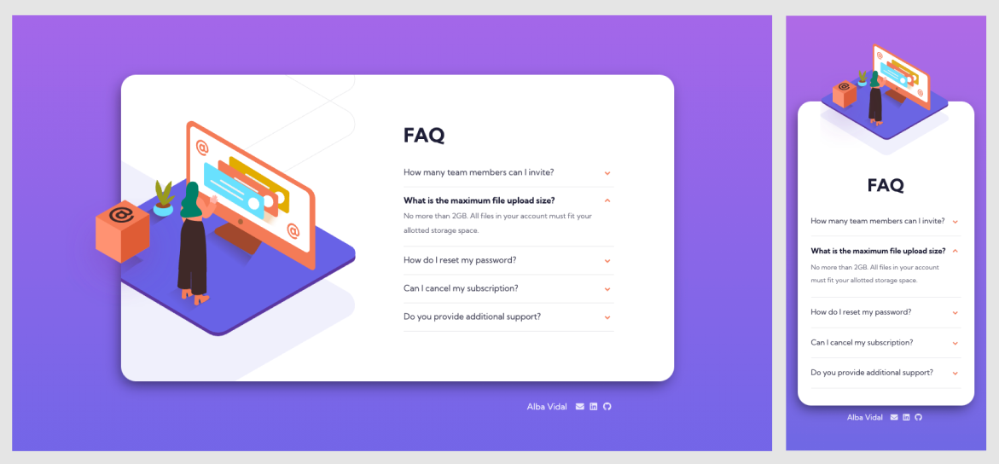

# FAQ accordion card

## Table of contents

- [Overview](#overview)
  - [The challenge](#the-challenge)
  - [Stage](#stage-🏗)
  - [Screenshots](#screenshots)
  - [Links](#links)
- [My process](#my-process)
  - [Built with](#built-with)
  - [What I learned](#what-i-learned)
  - [Thanks to](#thanks-to)
- [Author](#author)
- [Support](#🖤-support)

## Overview

### The challenge

- View the optimal layout for the component depending on their device's screen size (mobile 345px and desktop 1440px)
- See hover states for all interactive elements on the page
- Hide/Show the answer to a question when the question is clicked

### Stage 🏗

I'm refactoring the code but I've improved some animations, the HTML semantics and some of the JavaScript code that you can check in the other branches I created for the project.

### Screenshots

### Links

- Code: [https://github1s.com/albavidalm/FAQ-accordion-card](https://github1s.com/albavidalm/FAQ-accordion-card)

- Live Site URL: [https://albavidalm.github.io/FAQ-accordion-card/](https://albavidalm.github.io/FAQ-accordion-card/)

## My process

### Built with

- Semantic HTML5 markup
- CSS custom properties
- Sass
- Flexbox
- Animations
- JavaScript
- Mobile-first workflow

### What I learned

I refreshed my CSS, Sass and JavaScript skills and experimented with the Live Saas Compiler plugin for VSC (absolutely in love with it).

I'm specially proud of the animated box on the Desktop layout where I worked hard with the "position" properties.

### Thanks to

Thanks to my friend [Nur](https://github.com/NurAhissami) for helping me out of the bad loops.

## Author

- GitHub: [https://github.com/albavidalm](https://github.com/albavidalm)
- Email: [albavidalm @ gmail.com](mailto:albavidalm@gmail.com?subject=Hi)
- Linkedin: [https://www.linkedin.com/in/albavidalm/](https://www.linkedin.com/in/albavidalm/)

## 🖤 Support

Sharing is caring, contributions and suggestions are always welcome.
